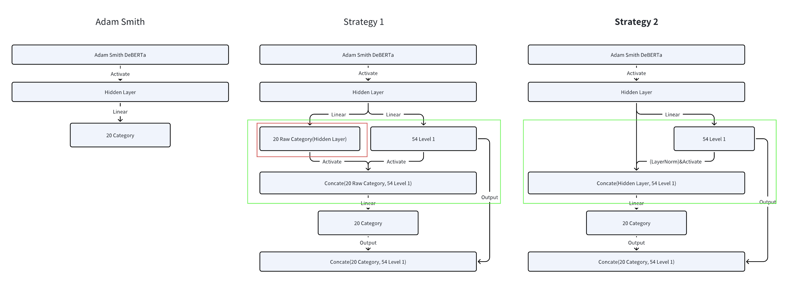

# README

> Project of MSBD5018 NLP course: Human Value Detection

## Course
HKUST MSBD5018 NLP

## Team
Group 14

## Member
- Renjie WU
- Shengyu XU
- Linni XIE
- Xue CUI

## Task Description
[SemEval-2023 Task 4: Human Value Detection](https://touche.webis.de/semeval23/touche23-web/index.html)

## Directory Structure
- Our final report is in [Group14_report.pdf](report/Group14_report.pdf)
- Our training/validation/test data is in [data](data)
- Our experiments are in file '[5018Project_ipynb(final).ipynb](5018Project_ipynb(final).ipynb)'
- Our best check points are stored in [onedrive](https://hkustconnect-my.sharepoint.com/:f:/g/personal/rwuap_connect_ust_hk/EkAODhT5uARIgkM-9cN-FM8Bs0GrSbxezIquIhvFtPW5ug?e=2yFK28).


## Code
We defined two strategies, below is our model structure:


## Environment
- Platform: Colab
- GPU: A100

## Parameters to modify in Code

1. create your own directory and modify `USER` to your own work directory
```python
# your user last_name dir, wu/xu/xie/cui
USER = "wu"

if USER == "":
  raise ValueError("name should not be empty, should in xu/wu/xie/cui")
```

2. modify hyper parameters for model definition and training
```python
strategy = 2 # you can use 1 or 2 to set the model architecture to related strategy
PARAMS = {
    "STRATEGY": strategy,
    "MAX_TOKEN_COUNT": 128, # our max text length is 90, so 128 may be enough
    "TRAINING_DATAPATH": os.path.join(project_dir, "./data/training.csv"),  # training data path
    "VALIDATION_DATAPATH": os.path.join(project_dir, "./data/validation.csv"),  # validation data path
    "TEST_DATAPATH": os.path.join(project_dir, "./data/test.csv"),  # test data path
    "TEST_nah_DATAPATH": os.path.join(project_dir, "./data/test-nahjalbalagha.csv"),    # another test data path
    "BATCH_SIZE": 64, # batch size 
    "NUM_TRAIN_WORKERS": 4, # parallel workers for training
    "NUM_VAL_WORKERS": 4,  # parallel workers for validation
    "LEARNING_RATE": 1.5e-6, # learning rate, 1e-5 to 1e-6 is the best range
    "LOSS_RATIO": 0.73, # float in [0,1] or None, when None, the training will use basic BCE
    "NUM_EPOCHES": 40, # training epochs
    "CHECKPOINT_PATH": os.path.join(project_dir, f'./checkpoints/{USER}/resbert{strategy}.pt'), # checkpoint path
    "SCORE_PATH": os.path.join(project_dir, f'./checkpoints/{USER}/score{strategy}.json'), # checkpoint related f1 score, loss, accuracy info
    "THRESHOLD": 0.25   # threshold for calculate f1 score, accuracy, etc.
}
```

3. execute the '[Notebook](./5018Project_ipynb(final).ipynb)'
4. our model will save the best checkpoint with its validation info, the criterion is the best validation f1 score.